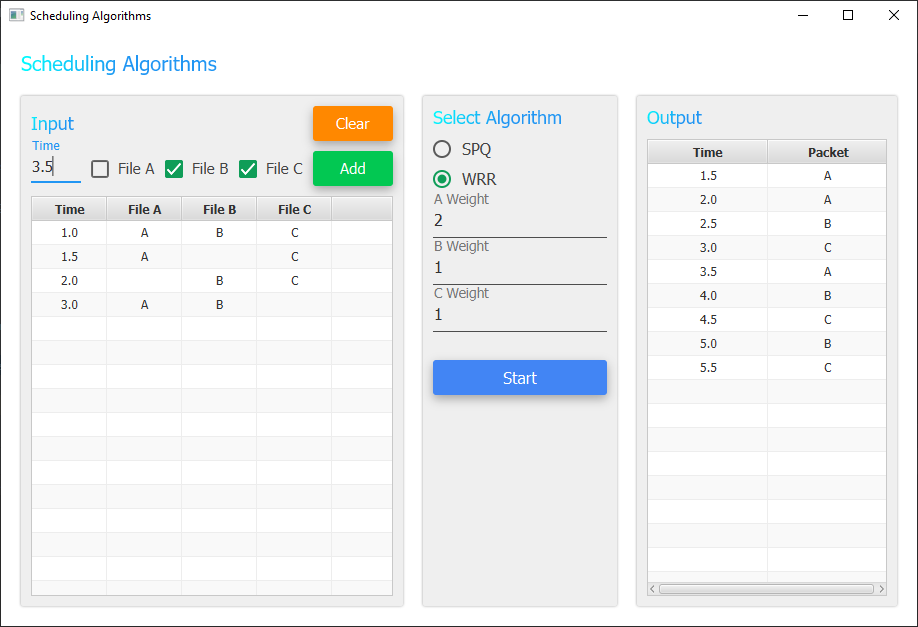

<h1 align="center">Scheduling Algorithms</h1>

  
  

## Introduction
Strict Priority Queueing (SPQ) and Weighted Round Robin (WRR) are two common scheduling techniques to achieve Quality-of-Service (QoS) while using shared resources, i tried implemented this techniques of scheduling, because i did not find the implementation in Java language.

## Algorithms
- [x] SPQ (Strict Priority Queueing)
- [x] WRR (Weighted Round Robin)

## Screenshots
Main App          |
:-----------------:|
 |
